# RideShare Lite - All Mermaid Diagrams

## Diagram 1: System Architecture Overview

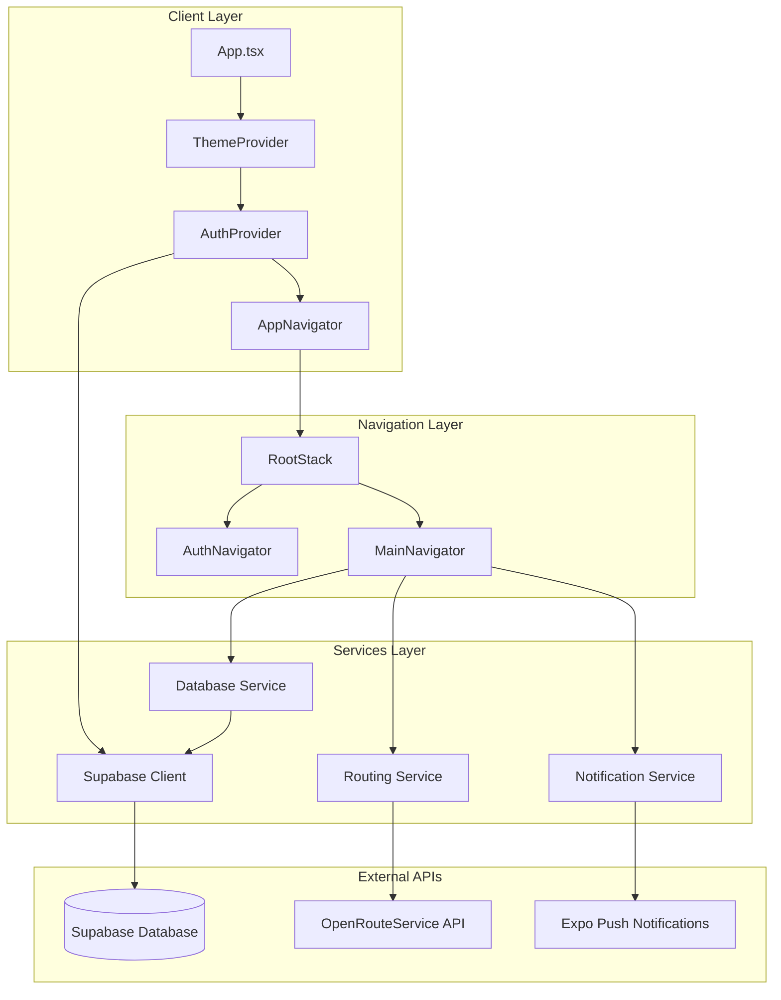

---

## Diagram 2: Complete Navigation Flow

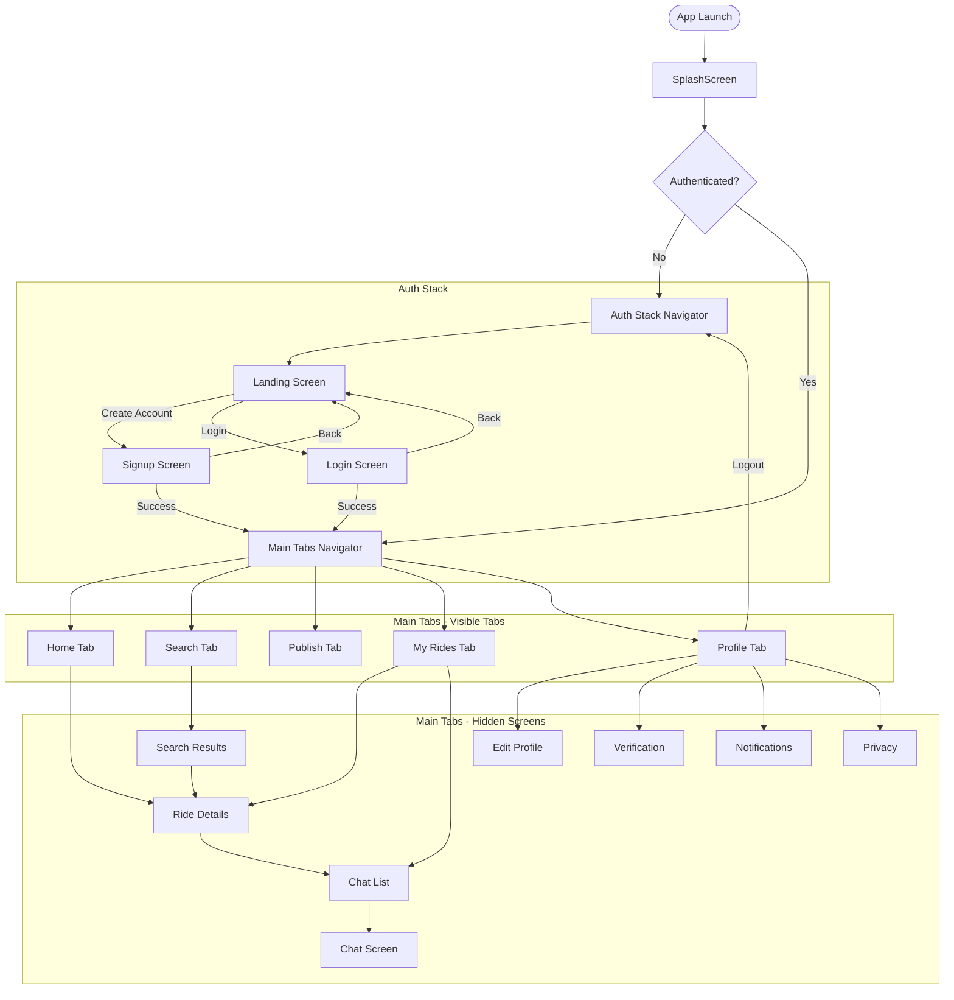

---

## Diagram 3: Authentication Flow

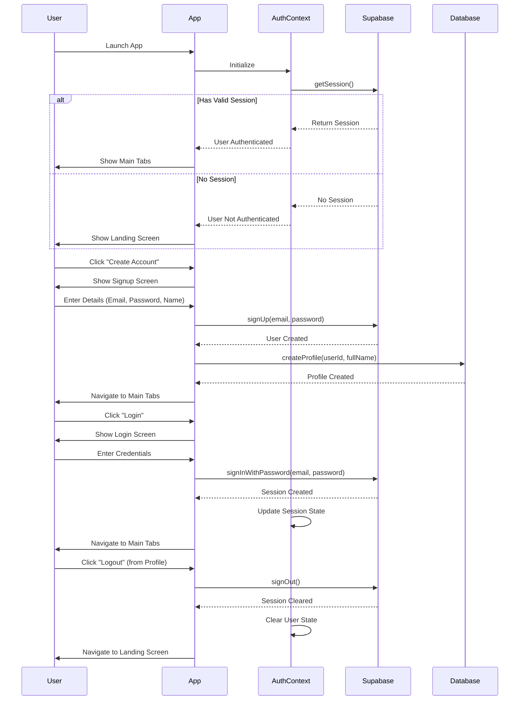

---

## Diagram 4: Passenger User Journey

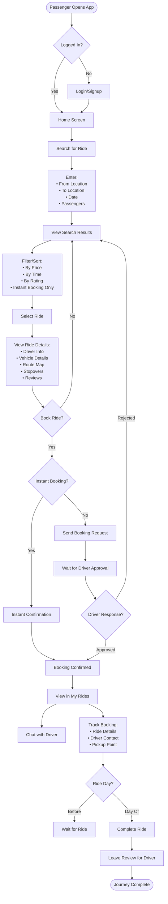

---

## Diagram 5: Driver User Journey

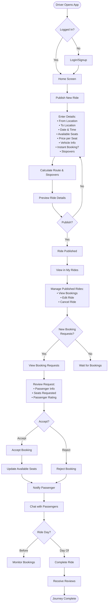

---

## Diagram 6: Data Flow - Ride Search & Booking

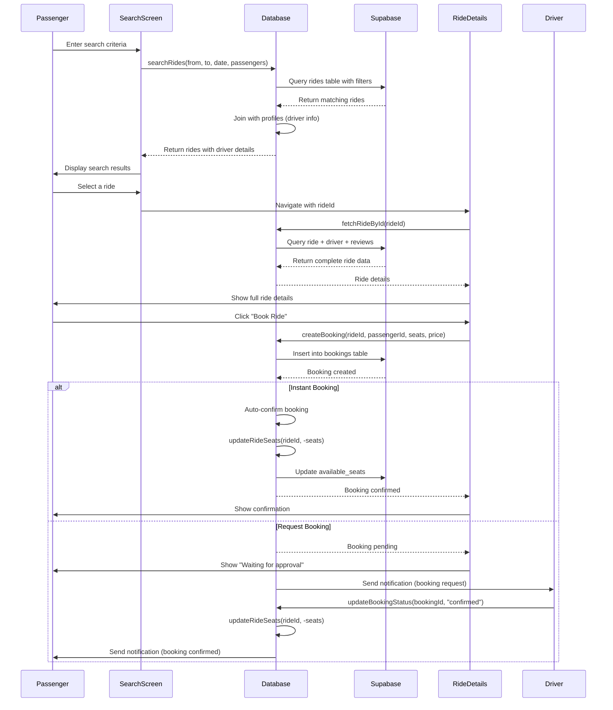

---

## Diagram 7: Data Flow - Ride Publishing

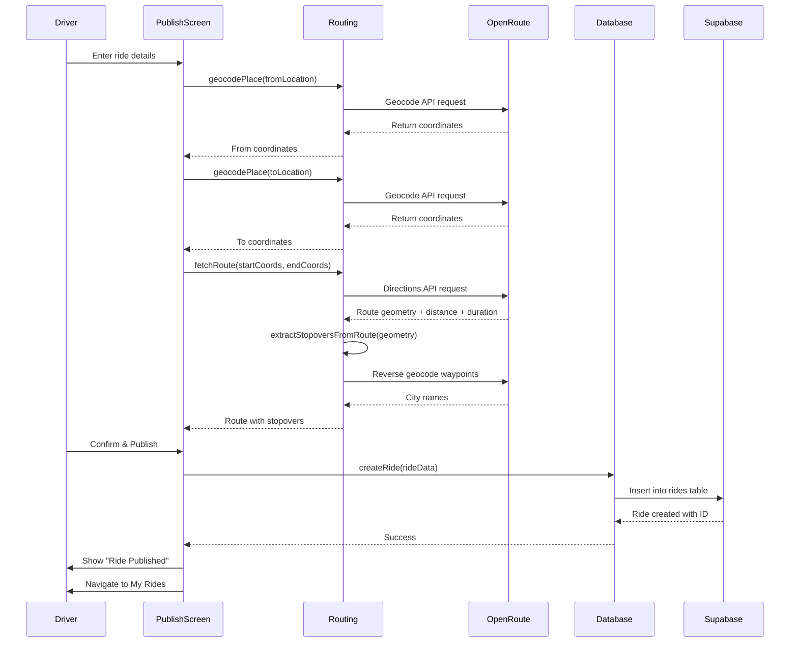

---

## Diagram 8: Data Flow - Chat System

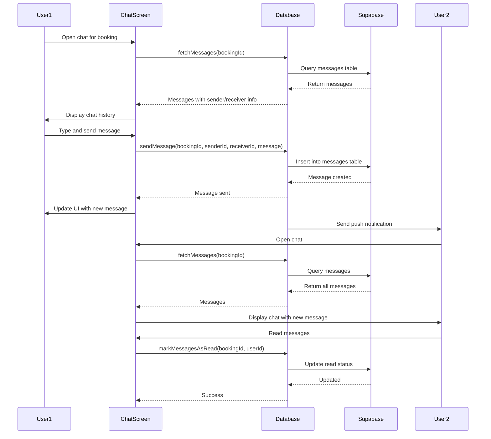

---

## Diagram 9: Database Schema Overview

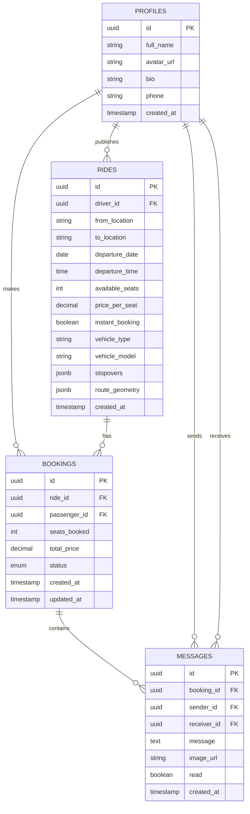

---

## Diagram 10: Feature Flow - My Rides Screen

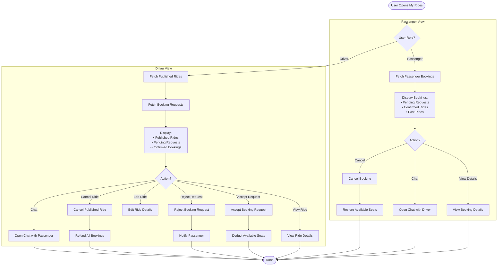

---

## Diagram 11: Theme System Flow

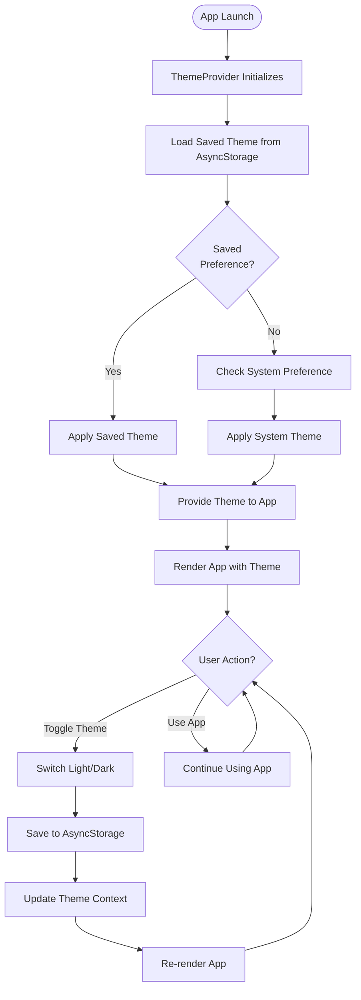

---

## Diagram 12: Notification Flow

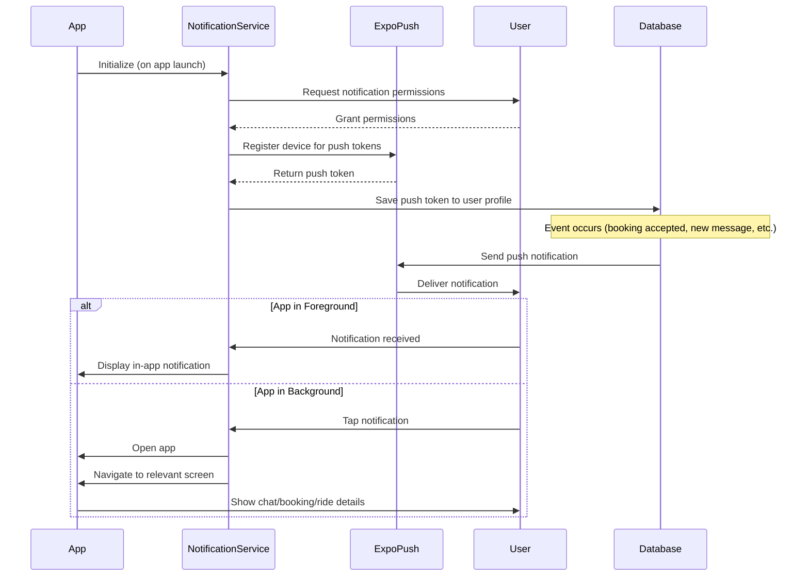

---

## Diagram 13: Screen Hierarchy

```mermaid
graph TB
    App[App.tsx] --> Root[RootStack Navigator]

    Root --> Auth[Auth Stack]
    Root --> Main[Main Tabs]

    subgraph "Auth Stack Screens"
        Auth --> Landing[LandingScreen]
        Auth --> Login[LoginScreen]
        Auth --> Signup[SignupScreen]
    end

    subgraph "Main Tab Screens - Visible"
        Main --> Home[HomeScreen]
        Main --> Search[SearchScreen]
        Main --> Publish[PublishScreen]
        Main --> MyRides[MyRidesScreen]
        Main --> Profile[ProfileScreen]
    end

    subgraph "Main Tab Screens - Hidden"
        Main --> SearchResults[SearchResultsScreen]
        Main --> RideDetails[RideDetailsScreen]
        Main --> EditProfile[EditProfileScreen]
        Main --> Verification[VerificationScreen]
        Main --> NotificationsScreen[NotificationsScreen]
        Main --> Privacy[PrivacyScreen]
        Main --> ChatList[ChatListScreen]
        Main --> Chat[ChatScreen]
    end

    subgraph "Splash"
        Root --> Splash[SplashScreen]
    end
```

---

**Total: 13 Mermaid Diagrams**

You can copy any of these code blocks and use them in:
- Mermaid Live Editor (https://mermaid.live)
- GitHub/GitLab markdown files
- Notion, Confluence, or any tool that supports Mermaid
- VS Code with Mermaid preview extensions
