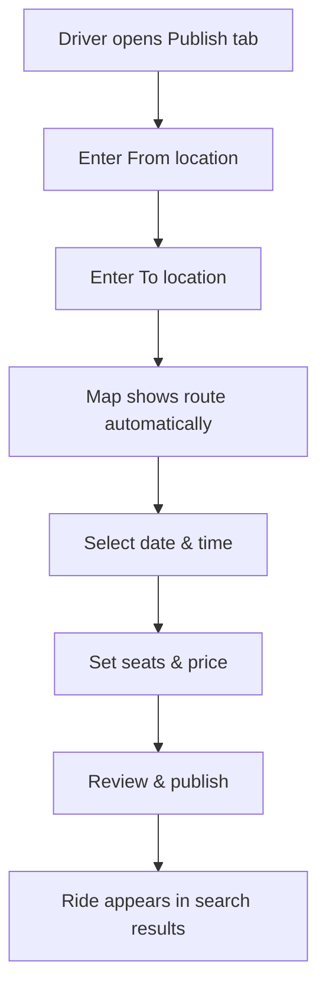
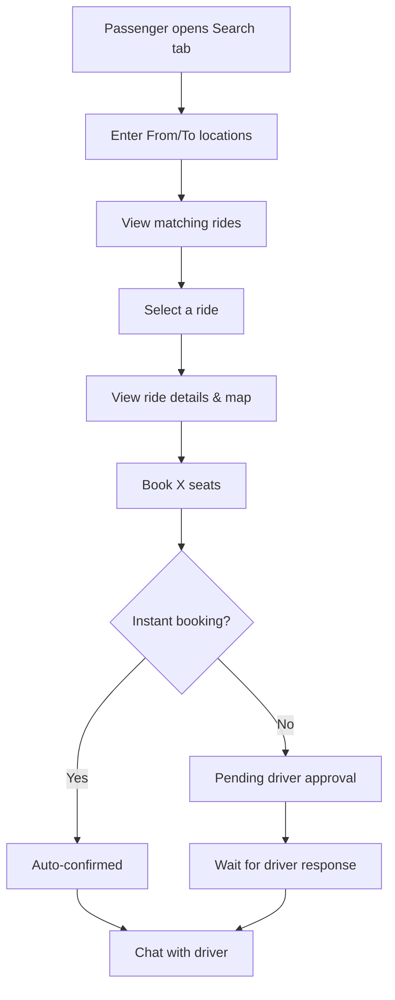
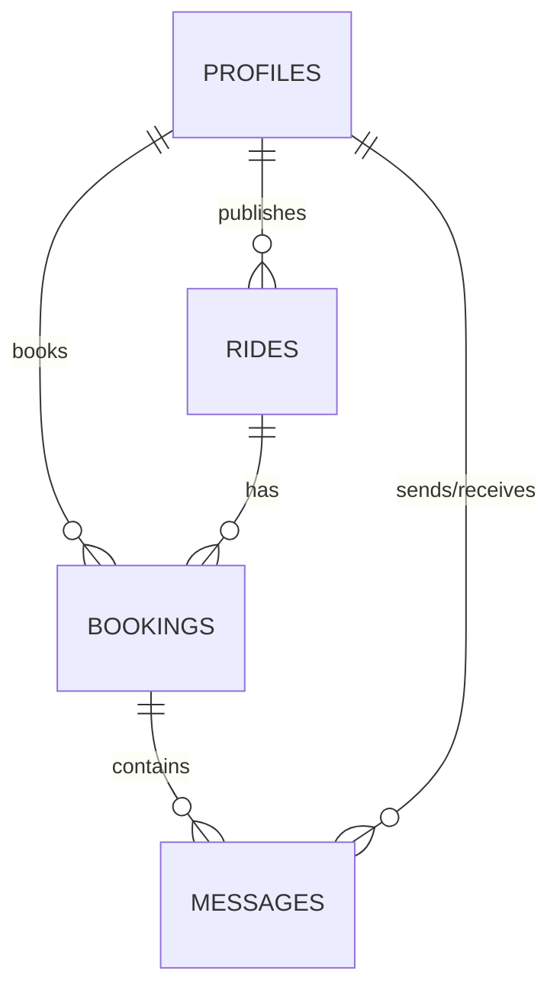

# RideShare Lite - Product Requirements Document

**Project Type:** College Assignment
**Course:** Mobile Application Development
**Created:** October 2025
**Team:** Shashank Goel

---

## 1. Project Overview

**RideShare Lite** is a cross-platform carpooling application built as a college project to demonstrate full-stack mobile development skills. The app connects drivers with passengers traveling the same route, enabling cost-effective and eco-friendly travel.

### Learning Objectives
- Build a complete mobile app using React Native and Expo
- Implement user authentication and authorization
- Design and integrate a relational database
- Work with external APIs (maps and routing)
- Implement real-time features using WebSockets
- Create a modern, responsive UI with dark/light themes

### Problem Statement
Students and working professionals often travel alone on the same routes, leading to:
- High transportation costs
- Wasted car seats
- Increased traffic congestion
- Higher carbon emissions

### Solution
A mobile app where users can:
- **As Drivers:** Publish upcoming trips and share seats
- **As Passengers:** Search for rides and book available seats
- **Both:** Communicate via in-app chat and receive real-time updates

---

## 2. Core Features

### Feature 1: User Authentication
**What it does:** Allows users to create accounts and log in securely.

**Implementation:**
- Email/password registration
- Email verification
- Login with session persistence
- Profile management (name, photo, bio, phone)
- Logout functionality

**Technologies:**
- Supabase Auth for backend authentication
- React Context API for managing auth state
- AsyncStorage for session persistence

---

### Feature 2: Ride Publishing (Driver Side)
**What it does:** Drivers can create and publish rides for upcoming trips.

**Implementation:**
- Multi-step form with:
  - From/To locations (autocomplete)
  - Date and time picker
  - Number of available seats (1-7)
  - Price per seat
  - Instant booking option
  - Vehicle details (optional)
- Interactive map showing route
- Automatic route calculation (distance, duration, stopovers)

**Technologies:**
- OpenRouteService API for routing
- React Native Maps (mobile) / Leaflet (web)
- Custom form components with validation

**User Flow:**


---

### Feature 3: Ride Search & Booking (Passenger Side)
**What it does:** Passengers can search for rides and book seats.

**Implementation:**
- Search form with filters:
  - From/To locations (required)
  - Date (optional)
  - Number of passengers
  - Instant booking only (toggle)
- Search results showing:
  - Driver info (name, photo)
  - Departure time
  - Available seats
  - Price per seat
  - Route with stopovers
- Ride details page with full route map
- Booking flow with seat selection

**Technologies:**
- Supabase database queries with filters
- Real-time seat availability updates
- Duplicate booking prevention

**User Flow:**


---

### Feature 4: Booking Management
**What it does:** Manage bookings for both drivers and passengers.

**For Passengers:**
- View all bookings (upcoming, past, cancelled)
- See booking status (pending/confirmed/rejected)
- Cancel bookings
- Contact driver via chat

**For Drivers:**
- View booking requests for published rides
- Accept or reject requests
- View passenger details
- Manage published rides (edit, cancel)

**Technologies:**
- Supabase Realtime for instant status updates
- Push notifications for booking events

---

### Feature 5: Real-time Chat
**What it does:** In-app messaging between drivers and passengers.

**Implementation:**
- One-to-one chat for confirmed bookings
- Text messages with timestamps
- Read receipts
- Real-time message delivery
- Conversation list showing all active chats

**Technologies:**
- `react-native-gifted-chat` library
- Supabase Realtime for instant message sync
- Messages stored in database

---

### Feature 6: Interactive Maps
**What it does:** Visual route display on maps.

**Implementation:**
- Platform-specific maps:
  - **Mobile (iOS/Android):** React Native Maps
  - **Web:** Leaflet with OpenStreetMap
- Features:
  - Route polyline
  - Start/end markers
  - Stopover markers
  - Zoom and pan controls

**Technologies:**
- OpenRouteService API for route geometry
- GeoJSON format for route data
- Geocoding for city name → coordinates

---

### Feature 7: Push Notifications
**What it does:** Real-time alerts for important events.

**Notification Types:**
- New booking request (driver)
- Booking confirmed/rejected (passenger)
- Booking cancelled
- New chat message

**Technologies:**
- Expo Push Notifications
- Push token storage in database
- Notification handlers for navigation

---

### Feature 8: Dark/Light Theme
**What it does:** Modern UI with theme switching.

**Implementation:**
- Light and dark color schemes
- Theme toggle in profile settings
- Persistent theme preference
- Glassmorphism effects (frosted glass cards)
- Gradient buttons
- Smooth transitions

**Technologies:**
- React Context API for theme state
- AsyncStorage for persistence
- Custom styled components

---

## 3. Technical Architecture

### Technology Stack

```
Frontend:
├── React Native 0.81.5 (Cross-platform framework)
├── Expo SDK 54 (Build and deployment)
├── TypeScript 5.9 (Type safety)
└── React Navigation 7 (Routing)

Backend:
├── Supabase (Database + Auth + Realtime)
│   ├── PostgreSQL (Relational database)
│   ├── Row Level Security (Data protection)
│   └── WebSocket (Real-time subscriptions)

External APIs:
├── OpenRouteService (Maps and routing)
└── Expo Notifications (Push alerts)

UI Libraries:
├── react-native-maps (Mobile maps)
├── react-leaflet (Web maps)
├── react-native-gifted-chat (Chat interface)
└── expo-linear-gradient (Gradients)
```

---

## 4. Database Design

### Tables

```sql
-- User profiles
CREATE TABLE profiles (
  id UUID PRIMARY KEY,
  full_name TEXT NOT NULL,
  avatar_url TEXT,
  bio TEXT,
  phone TEXT,
  push_token TEXT,
  created_at TIMESTAMP DEFAULT NOW()
);

-- Published rides
CREATE TABLE rides (
  id UUID PRIMARY KEY,
  driver_id UUID REFERENCES profiles(id),
  from_location TEXT NOT NULL,
  to_location TEXT NOT NULL,
  departure_date DATE NOT NULL,
  departure_time TIME NOT NULL,
  available_seats INTEGER NOT NULL,
  price_per_seat DECIMAL(10,2) NOT NULL,
  instant_booking BOOLEAN DEFAULT FALSE,
  route_geometry JSONB,
  route_distance DECIMAL(10,2),
  stopovers TEXT[],
  status TEXT DEFAULT 'active',
  created_at TIMESTAMP DEFAULT NOW()
);

-- Ride bookings
CREATE TABLE bookings (
  id UUID PRIMARY KEY,
  ride_id UUID REFERENCES rides(id),
  passenger_id UUID REFERENCES profiles(id),
  seats_booked INTEGER NOT NULL,
  total_price DECIMAL(10,2) NOT NULL,
  status TEXT DEFAULT 'pending',
  created_at TIMESTAMP DEFAULT NOW(),
  UNIQUE(ride_id, passenger_id)
);

-- Chat messages
CREATE TABLE messages (
  id UUID PRIMARY KEY,
  booking_id UUID REFERENCES bookings(id),
  sender_id UUID REFERENCES profiles(id),
  receiver_id UUID REFERENCES profiles(id),
  message TEXT NOT NULL,
  read BOOLEAN DEFAULT FALSE,
  created_at TIMESTAMP DEFAULT NOW()
);
```

### Entity Relationships



---

## 5. Key Code Examples

### Authentication Context
```typescript
// src/context/AuthContext.tsx
export const AuthProvider = ({ children }) => {
  const [user, setUser] = useState<User | null>(null);
  const [loading, setLoading] = useState(true);

  useEffect(() => {
    // Get initial session
    supabase.auth.getSession().then(({ data: { session } }) => {
      setUser(session?.user ?? null);
      setLoading(false);
    });

    // Listen for auth changes
    const { data: { subscription } } = supabase.auth.onAuthStateChange(
      (event, session) => {
        setUser(session?.user ?? null);
      }
    );

    return () => subscription.unsubscribe();
  }, []);

  const signIn = async (email: string, password: string) => {
    const { error } = await supabase.auth.signInWithPassword({
      email, password
    });
    if (error) throw error;
  };

  return (
    <AuthContext.Provider value={{ user, loading, signIn }}>
      {children}
    </AuthContext.Provider>
  );
};
```

### Creating a Ride
```typescript
// src/services/database.ts
export const createRide = async (rideData) => {
  const { data, error } = await supabase
    .from('rides')
    .insert([rideData])
    .select()
    .single();

  if (error) throw error;
  return data;
};
```

### Searching Rides
```typescript
// src/services/database.ts
export const searchRides = async (params) => {
  let query = supabase
    .from('rides')
    .select(`
      *,
      driver:profiles!driver_id (id, full_name, avatar_url)
    `)
    .gte('available_seats', params.passengers || 1)
    .eq('status', 'active');

  if (params.from) {
    query = query.ilike('from_location', `%${params.from}%`);
  }
  if (params.to) {
    query = query.ilike('to_location', `%${params.to}%`);
  }

  const { data, error } = await query
    .order('departure_date', { ascending: true });

  return data || [];
};
```

### Real-time Booking Updates
```typescript
// src/services/realtimeService.ts
export const subscribeToBookingUpdates = (userId, onUpdate) => {
  const channel = supabase
    .channel('booking-updates')
    .on(
      'postgres_changes',
      {
        event: '*',
        schema: 'public',
        table: 'bookings',
        filter: `passenger_id=eq.${userId}`
      },
      (payload) => {
        onUpdate(payload.new);
      }
    )
    .subscribe();

  return () => supabase.removeChannel(channel);
};
```

---

## 6. Project Structure

```
RideShareLite/
├── src/
│   ├── screens/              # All app screens
│   │   ├── auth/             # Landing, Login, Signup
│   │   ├── main/             # Home, Search, Publish, MyRides, Profile
│   │   ├── chat/             # ChatList, ChatScreen
│   │   └── profile/          # EditProfile, Notifications, Privacy
│   ├── components/           # Reusable UI components
│   │   ├── GlassCard.tsx
│   │   ├── GradientButton.tsx
│   │   ├── AnimatedBackground.tsx
│   │   └── maps/             # Platform-specific maps
│   ├── navigation/
│   │   └── AppNavigator.tsx  # Navigation setup
│   ├── services/             # Backend integration
│   │   ├── database.ts       # Supabase queries
│   │   ├── supabase.ts       # Supabase client
│   │   ├── routing.ts        # OpenRouteService API
│   │   ├── notifications.ts  # Push notifications
│   │   └── realtimeService.ts
│   ├── context/              # Global state
│   │   ├── AuthContext.tsx
│   │   └── ThemeContext.tsx
│   └── styles/
│       └── theme.ts          # Theme definitions
├── App.tsx                   # Root component
├── package.json              # Dependencies
└── app.config.js             # Expo configuration
```

---

## 7. Development Timeline

### Week 1-2: Setup & Authentication
- [x] Initialize React Native + Expo project
- [x] Set up Supabase backend
- [x] Create database tables
- [x] Implement signup/login/logout
- [x] Build profile management screens

### Week 3-4: Ride Publishing
- [x] Build multi-step ride creation form
- [x] Integrate OpenRouteService API
- [x] Implement map components (iOS/Android/Web)
- [x] Add route calculation and visualization

### Week 5-6: Search & Booking
- [x] Create search screen with filters
- [x] Build ride details page with map
- [x] Implement booking creation
- [x] Add booking management for drivers/passengers

### Week 7-8: Real-time Features
- [x] Implement Supabase Realtime subscriptions
- [x] Build in-app chat with Gifted Chat
- [x] Add push notifications
- [x] Create conversation list

### Week 9-10: UI/UX & Testing
- [x] Implement dark/light mode
- [x] Add glassmorphism UI components
- [x] Test on iOS, Android, and Web
- [x] Bug fixes and polish

---

## 8. Challenges & Solutions

### Challenge 1: Cross-platform Maps
**Problem:** Different map libraries for mobile and web.

**Solution:**
- Created platform-specific map components
- Used `react-native-maps` for iOS/Android
- Used `react-leaflet` for web
- Shared map wrapper component for consistent API

### Challenge 2: Real-time Updates
**Problem:** Booking status changes need to reflect instantly.

**Solution:**
- Implemented Supabase Realtime subscriptions
- Subscribed to database changes on `bookings` table
- Updated UI automatically when data changes
- Added push notifications for background updates

### Challenge 3: Route Calculation
**Problem:** Need to calculate distance and show route on map.

**Solution:**
- Integrated OpenRouteService API
- Geocoded city names to coordinates
- Fetched route geometry (GeoJSON)
- Displayed polyline on map
- Extracted intermediate stopovers for long routes

### Challenge 4: Duplicate Bookings
**Problem:** Users could book the same ride multiple times.

**Solution:**
- Added unique constraint on `(ride_id, passenger_id)`
- Database prevents duplicate entries
- Show user-friendly error message
- Redirect to existing booking

---

## 9. Future Enhancements (Stretch Goals)

### 1. Payment Integration
- Online payment via Razorpay/Stripe
- Wallet system for credits
- Automated payouts to drivers

### 2. Ratings & Reviews
- Post-ride ratings (1-5 stars)
- Text reviews
- Average rating on profiles

### 3. Recurring Rides
- Save frequent routes as templates
- Publish weekly/daily rides automatically
- Auto-matching for regular commuters

### 4. Advanced Safety
- Phone verification (OTP)
- ID verification
- Emergency SOS button
- Share ride details with emergency contact

### 5. Gamification
- Achievement badges (e.g., "100 Rides")
- Leaderboards
- Carbon footprint tracking
- Referral program

---

## 10. Learning Outcomes

### Technical Skills Gained
- ✅ Full-stack mobile app development
- ✅ React Native and Expo framework
- ✅ TypeScript for type-safe code
- ✅ Database design and SQL
- ✅ RESTful API integration
- ✅ Real-time WebSocket communication
- ✅ Push notification implementation
- ✅ State management with Context API
- ✅ Cross-platform development (iOS/Android/Web)

### Soft Skills Developed
- ✅ Project planning and documentation
- ✅ Problem-solving and debugging
- ✅ UI/UX design principles
- ✅ Time management
- ✅ Version control with Git

---

## 11. How to Run the Project

### Prerequisites
```bash
# Install Node.js (v18+)
# Install Git
```

### Setup
```bash
# Clone the repository
git clone https://github.com/Shashank-Ge/Ride-Share-Lite-.git
cd RideShareLite

# Install dependencies
npm install

# Create .env file
cp .env.example .env
# Add your Supabase credentials
```

### Run on Different Platforms
```bash
# Start Expo development server
npx expo start

# Then press:
# 'a' for Android
# 'i' for iOS (Mac only)
# 'w' for Web
```

---

## 12. Conclusion

**RideShare Lite** successfully demonstrates the ability to build a complete, production-quality mobile application using modern technologies. The project covers:

- **Frontend:** React Native with TypeScript
- **Backend:** Supabase (database, auth, real-time)
- **External APIs:** OpenRouteService for maps
- **Real-time Features:** Chat and booking updates
- **Modern UI:** Dark/light themes with glassmorphism

The app is fully functional across iOS, Android, and Web platforms, showcasing cross-platform development skills and full-stack capabilities.

---

**Project Repository:** https://github.com/Shashank-Ge/Ride-Share-Lite-.git

**Developed by:** Shashank Goel
**Course:** Product Development
**Semester:** 3
**Year:** 2025
