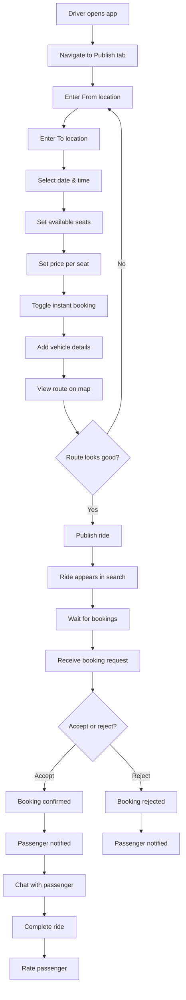
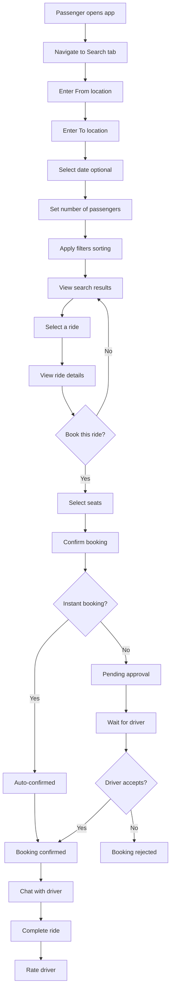
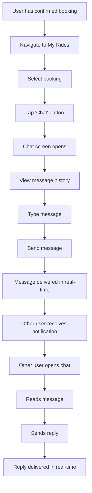
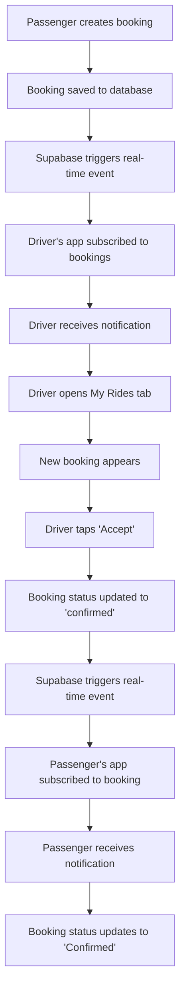

# Product Requirements Document (PRD)
# RideShare Lite

**Version:** 1.0
**Last Updated:** December 9, 2025
**Document Owner:** Product Team
**Status:** Active Development

---

## Table of Contents

1. [Executive Summary](#executive-summary)
2. [Product Overview](#product-overview)
3. [Target Audience](#target-audience)
4. [User Personas](#user-personas)
5. [Product Goals & Objectives](#product-goals--objectives)
6. [Features & Requirements](#features--requirements)
7. [Technical Architecture](#technical-architecture)
8. [User Flows](#user-flows)
9. [Data Models](#data-models)
10. [Success Metrics](#success-metrics)
11. [Roadmap](#roadmap)
12. [Risks & Mitigation](#risks--mitigation)

---

## Executive Summary

**RideShare Lite** is a cross-platform (iOS, Android, Web) carpooling application that connects drivers with passengers traveling the same route. The app enables cost-effective, eco-friendly travel by facilitating ride-sharing between verified users.

### Key Highlights
- **Platform:** React Native with Expo (iOS, Android, Web)
- **Backend:** Supabase (PostgreSQL, Real-time, Authentication)
- **Core Value:** Reduce travel costs by 50-70% through ride-sharing
- **Target Launch:** Q1 2026
- **Initial Markets:** Urban and inter-city routes in India

---

## Product Overview

### Vision
To create the most accessible and user-friendly carpooling platform that makes shared mobility affordable, safe, and convenient for everyone.

### Mission
Connect travelers going the same way, reduce carbon footprint, and build a trusted community of riders and drivers.

### Problem Statement
1. **High Transportation Costs:** Solo travel is expensive, especially for long-distance routes
2. **Environmental Impact:** Single-occupancy vehicles contribute significantly to emissions
3. **Limited Options:** Existing ride-sharing apps focus on on-demand rides, not planned carpooling
4. **Trust Issues:** Lack of verification and communication features in current solutions

### Solution
RideShare Lite provides:
- **Easy Ride Publishing:** Drivers can publish upcoming trips with flexible pricing
- **Smart Search:** Passengers find rides matching their route and schedule
- **Real-time Communication:** Built-in chat for coordination
- **Instant Booking:** Optional instant confirmation for time-sensitive bookings
- **Safety Features:** User verification, ratings, and profile information
- **Multi-platform Access:** Available on mobile (iOS/Android) and web

---

## Target Audience

### Primary Users
1. **Daily Commuters** (25-45 years)
   - Office workers traveling to/from work
   - College students with regular schedules
   - Frequency: 5-10 rides/week

2. **Inter-city Travelers** (20-55 years)
   - Weekend travelers visiting family/friends
   - Business travelers on budget
   - Frequency: 2-8 rides/month

3. **Occasional Riders** (18-65 years)
   - Event attendees (concerts, sports, festivals)
   - Airport transfers
   - Frequency: 1-4 rides/month

### Secondary Users
- **Car Owners** looking to offset fuel costs
- **Environmental Advocates** seeking sustainable transport
- **Budget-Conscious Travelers** prioritizing cost savings

---

## User Personas

### Persona 1: Priya - The Daily Commuter
**Demographics:**
- Age: 28
- Occupation: Software Engineer
- Location: Bangalore
- Income: ₹8-12 LPA

**Goals:**
- Save money on daily commute (₹300/day → ₹100/day)
- Reduce stress of driving in traffic
- Network with professionals

**Pain Points:**
- High fuel and parking costs
- Traffic congestion
- Lack of reliable carpooling options

**Usage Pattern:**
- Books rides 1 day in advance
- Prefers same driver/passengers for routine
- Uses app 10-12 times/week

---

### Persona 2: Rajesh - The Weekend Driver
**Demographics:**
- Age: 35
- Occupation: Marketing Manager
- Location: Delhi
- Income: ₹15-20 LPA

**Goals:**
- Offset fuel costs on weekend trips home
- Meet new people
- Utilize empty car seats

**Pain Points:**
- Traveling alone is boring and expensive
- Uncertainty about finding passengers
- Safety concerns about unknown riders

**Usage Pattern:**
- Publishes rides 3-5 days in advance
- Travels Delhi-Jaipur every 2 weeks
- Prefers verified passengers with good ratings

---

### Persona 3: Ananya - The Student Traveler
**Demographics:**
- Age: 21
- Occupation: College Student
- Location: Pune
- Income: Limited (parental support)

**Goals:**
- Affordable travel to visit family
- Safe and reliable rides
- Flexible booking options

**Pain Points:**
- Limited budget for travel
- Safety concerns traveling alone
- Inflexible bus/train schedules

**Usage Pattern:**
- Books rides 1-2 weeks in advance
- Travels Pune-Mumbai monthly
- Price-sensitive, prefers cheapest options

---

## Product Goals & Objectives

### Business Goals
1. **User Acquisition:** 100,000 registered users in Year 1
2. **Active Users:** 20% monthly active user rate
3. **Rides Completed:** 50,000 successful rides in Year 1
4. **Revenue:** ₹50 lakhs ARR through commission model (10-15% per booking)

### User Experience Goals
1. **Ease of Use:** 90% of users complete first booking within 5 minutes
2. **Trust & Safety:** 95% user verification rate
3. **Reliability:** 85% booking confirmation rate
4. **Satisfaction:** 4.5+ star average rating

### Technical Goals
1. **Performance:** App load time < 2 seconds
2. **Availability:** 99.5% uptime
3. **Scalability:** Support 1M+ users without performance degradation
4. **Cross-platform:** Consistent experience across iOS, Android, and Web

---

## Features & Requirements

### 1. Authentication & User Management

#### 1.1 User Registration
**Priority:** P0 (Must Have)

**Requirements:**
- Email/password registration
- Email verification required
- Profile creation with mandatory fields:
  - Full name
  - Phone number
  - Profile photo (optional)
  - Bio (optional)

**Acceptance Criteria:**
- User can create account in < 2 minutes
- Email verification sent within 30 seconds
- Profile data stored securely in database

---

#### 1.2 User Login
**Priority:** P0 (Must Have)

**Requirements:**
- Email/password authentication
- "Remember me" functionality
- Password reset via email
- Session management (7-day expiry)

**Acceptance Criteria:**
- Login completes in < 3 seconds
- Invalid credentials show clear error messages
- Session persists across app restarts

---

#### 1.3 Profile Management
**Priority:** P0 (Must Have)

**Requirements:**
- View and edit profile information
- Upload/change profile photo
- Add vehicle details (for drivers):
  - Make, model, color
  - License plate (optional)
- View ride history and ratings
- Manage notification preferences

**Acceptance Criteria:**
- Profile updates save within 2 seconds
- Photo upload supports JPEG/PNG up to 5MB
- Changes reflect immediately in app

---

### 2. Ride Publishing (Driver Features)

#### 2.1 Create Ride
**Priority:** P0 (Must Have)

**Requirements:**
- Multi-step ride creation form:
  1. **Route:** From/To locations with autocomplete
  2. **Schedule:** Date and time picker
  3. **Capacity:** Number of available seats (1-7)
  4. **Pricing:** Price per seat (₹50-₹5000)
  5. **Preferences:** Instant booking toggle, vehicle details
- Route visualization on map with:
  - Calculated distance and duration
  - Automatic stopover detection
  - Route geometry display
- Save as draft functionality
- Publish confirmation screen

**Acceptance Criteria:**
- Ride creation completes in < 3 minutes
- Map shows accurate route using OpenRouteService API
- Stopovers automatically detected from route
- Published rides appear in search within 10 seconds

**Technical Details:**
- Integration with OpenRouteService for routing
- Support for 1000+ Indian cities
- Fallback to manual location entry if autocomplete fails

---

#### 2.2 Manage Published Rides
**Priority:** P0 (Must Have)

**Requirements:**
- View all published rides (active, completed, cancelled)
- Edit ride details before departure
- Cancel rides with passenger notification
- View booking requests for each ride
- Accept/reject booking requests
- View passenger details and ratings

**Acceptance Criteria:**
- Ride list loads in < 2 seconds
- Status updates reflect in real-time
- Passengers notified within 30 seconds of status change

---

### 3. Ride Booking (Passenger Features)

#### 3.1 Search Rides
**Priority:** P0 (Must Have)

**Requirements:**
- Search form with filters:
  - From location (required)
  - To location (required)
  - Date (optional, defaults to today)
  - Number of passengers (default: 1)
  - Instant booking only (toggle)
- Sort options:
  - Price (low to high)
  - Departure time (earliest first)
  - Rating (highest first)
- Search results display:
  - Driver name, photo, rating
  - Departure time and date
  - Available seats
  - Price per seat
  - Route with stopovers
  - Instant booking badge

**Acceptance Criteria:**
- Search returns results in < 3 seconds
- Results update as filters change
- Empty state shown if no rides found
- Minimum 10 rides displayed per page

---

#### 3.2 View Ride Details
**Priority:** P0 (Must Have)

**Requirements:**
- Detailed ride information:
  - Full route with map visualization
  - All stopovers listed
  - Driver profile (name, photo, bio, rating, reviews)
  - Vehicle details
  - Pricing breakdown
  - Cancellation policy
- "Book Now" button (prominent)
- "Contact Driver" button (opens chat)
- Share ride link functionality

**Acceptance Criteria:**
- Page loads in < 2 seconds
- Map displays full route accurately
- All driver information visible
- Booking button disabled if seats unavailable

---

#### 3.3 Book Ride
**Priority:** P0 (Must Have)

**Requirements:**
- Seat selection (1 to available seats)
- Price calculation (seats × price per seat)
- Booking confirmation:
  - Instant booking: Auto-confirmed
  - Regular booking: Pending driver approval
- Payment integration (future: online payment)
- Booking confirmation email/notification
- Add to calendar functionality

**Acceptance Criteria:**
- Booking completes in < 5 seconds
- Confirmation notification sent immediately
- Available seats updated in real-time
- Duplicate booking prevented (same passenger + ride)

---

#### 3.4 Manage Bookings
**Priority:** P0 (Must Have)

**Requirements:**
- View all bookings:
  - Upcoming rides
  - Past rides
  - Cancelled bookings
- Booking status indicators:
  - Pending (yellow)
  - Confirmed (green)
  - Rejected (red)
  - Cancelled (gray)
- Cancel booking (with driver notification)
- Rate and review after ride completion
- Contact driver via chat

**Acceptance Criteria:**
- Booking list loads in < 2 seconds
- Status updates in real-time
- Cancellation processed within 10 seconds
- Seats restored to ride upon cancellation

---

### 4. Real-time Communication

#### 4.1 In-App Chat
**Priority:** P1 (Should Have)

**Requirements:**
- One-to-one chat between driver and passenger
- Chat available only for confirmed bookings
- Message features:
  - Text messages
  - Image sharing (optional)
  - Read receipts
  - Typing indicators
- Message history preserved
- Push notifications for new messages

**Acceptance Criteria:**
- Messages delivered in < 2 seconds
- Real-time updates using Supabase subscriptions
- Chat accessible from booking details
- Unread message count displayed

**Technical Details:**
- Built with `react-native-gifted-chat`
- Messages stored in Supabase `messages` table
- Real-time sync via Supabase Realtime

---

#### 4.2 Conversation List
**Priority:** P1 (Should Have)

**Requirements:**
- View all active conversations
- Display:
  - Other user's name and photo
  - Last message preview
  - Timestamp
  - Unread count badge
- Sort by most recent activity
- Search conversations

**Acceptance Criteria:**
- List loads in < 2 seconds
- Updates in real-time when new message received
- Tapping conversation opens chat screen

---

### 5. Notifications

#### 5.1 Push Notifications
**Priority:** P1 (Should Have)

**Requirements:**
- Notification types:
  - **Booking Created:** "You have a new booking request from [Name]"
  - **Booking Confirmed:** "Your booking for [Route] has been confirmed"
  - **Booking Rejected:** "Your booking for [Route] was declined"
  - **Booking Cancelled:** "[Name] cancelled their booking"
  - **New Message:** "New message from [Name]"
  - **Ride Reminder:** "Your ride to [Destination] is tomorrow"
- Platform support:
  - iOS: APNs
  - Android: FCM
  - Web: Web Push (future)
- Notification settings in profile

**Acceptance Criteria:**
- Notifications delivered within 30 seconds
- Tapping notification opens relevant screen
- User can enable/disable notification types
- Push token stored securely in database

**Technical Details:**
- Built with `expo-notifications`
- Token registration on app launch
- Server-side notification sending via Supabase Edge Functions (future)

---

#### 5.2 In-App Notifications
**Priority:** P2 (Nice to Have)

**Requirements:**
- Notification center in app
- Badge count on tab icon
- Mark as read functionality
- Notification history (last 30 days)

---

### 6. Maps & Routing

#### 6.1 Interactive Maps
**Priority:** P0 (Must Have)

**Requirements:**
- Platform-specific map components:
  - **iOS/Android:** `react-native-maps`
  - **Web:** `react-leaflet` with OpenStreetMap
- Map features:
  - Route polyline display
  - Start/end markers
  - Stopover markers
  - Zoom and pan controls
  - Current location button
- Map displayed on:
  - Ride creation screen
  - Ride details screen
  - Search results (optional)

**Acceptance Criteria:**
- Maps load in < 3 seconds
- Route displays accurately
- Markers are clearly visible
- Consistent experience across platforms

---

#### 6.2 Route Calculation
**Priority:** P0 (Must Have)

**Requirements:**
- Integration with OpenRouteService API
- Calculate:
  - Route geometry (GeoJSON)
  - Total distance (km)
  - Estimated duration (minutes)
  - Intermediate stopovers (cities)
- Fallback to straight-line distance if API fails
- Cache route data to reduce API calls

**Acceptance Criteria:**
- Route calculated in < 5 seconds
- Distance accurate within 5%
- Stopovers detected for routes > 100km
- API errors handled gracefully

**Technical Details:**
- API Key stored in environment variables
- Rate limiting: 2000 requests/day (free tier)
- Supports 1000+ Indian cities

---

### 7. Theme & UI/UX

#### 7.1 Dark/Light Mode
**Priority:** P1 (Should Have)

**Requirements:**
- System-wide theme support:
  - Light mode (default)
  - Dark mode
- Theme toggle in profile settings
- Persist theme preference
- Smooth theme transitions
- All screens support both themes

**Acceptance Criteria:**
- Theme changes apply instantly
- No UI glitches during transition
- Preference saved to AsyncStorage
- System theme detected on first launch

**Technical Details:**
- Built with `ThemeContext` and `ThemeProvider`
- Theme definitions in `src/styles/theme.ts`
- Uses React Context API for state management

---

#### 7.2 Glassmorphism & Gradients
**Priority:** P2 (Nice to Have)

**Requirements:**
- Modern UI components:
  - `GlassCard`: Frosted glass effect for cards
  - `GradientButton`: Gradient-filled buttons
  - `AnimatedBackground`: Animated gradient backgrounds
- Consistent design language across app
- Accessibility considerations (contrast ratios)

**Acceptance Criteria:**
- Components render smoothly (60fps)
- Gradients adapt to theme (light/dark)
- Glass effect visible on all backgrounds

---

### 8. Profile & Settings

#### 8.1 User Profile
**Priority:** P0 (Must Have)

**Requirements:**
- Display user information:
  - Profile photo
  - Full name
  - Bio
  - Phone number
  - Member since date
  - Total rides (as driver/passenger)
  - Average rating
- Edit profile button
- Logout button
- Settings access

**Acceptance Criteria:**
- Profile loads in < 2 seconds
- All information displayed correctly
- Logout clears session and redirects to landing

---

#### 8.2 Verification
**Priority:** P1 (Should Have)

**Requirements:**
- Verification types:
  - Email verification (mandatory)
  - Phone verification (OTP)
  - ID verification (upload government ID)
  - Driver's license (for drivers)
- Verification badges on profile
- Verification status in search results

**Acceptance Criteria:**
- Email verification completes in < 2 minutes
- Phone OTP delivered in < 30 seconds
- ID verification reviewed within 24 hours
- Verified badge displayed prominently

---

#### 8.3 Privacy & Security
**Priority:** P0 (Must Have)

**Requirements:**
- Privacy policy page
- Terms of service page
- Data deletion request
- Block user functionality
- Report user functionality
- Secure data storage (encryption at rest)

**Acceptance Criteria:**
- Privacy policy accessible from settings
- User can request data deletion
- Blocked users cannot contact or book rides
- Reports reviewed within 48 hours

---

### 9. Reviews & Ratings

#### 9.1 Rate Ride
**Priority:** P1 (Should Have)

**Requirements:**
- Post-ride rating prompt
- Rating scale: 1-5 stars
- Optional text review (500 characters max)
- Rate as driver or passenger
- Rating visible on user profile

**Acceptance Criteria:**
- Rating prompt shown after ride completion
- Rating submitted in < 30 seconds
- Average rating updated immediately
- Reviews moderated for inappropriate content

---

### 10. Admin & Moderation (Future)

#### 10.1 Admin Dashboard
**Priority:** P3 (Future)

**Requirements:**
- User management
- Ride monitoring
- Report handling
- Analytics dashboard
- Payment reconciliation

---

## Technical Architecture

### Technology Stack

#### Frontend
- **Framework:** React Native 0.81.5
- **Build Tool:** Expo SDK 54
- **Language:** TypeScript 5.9.2
- **Navigation:** React Navigation 7
  - Stack Navigator (auth flow)
  - Bottom Tabs Navigator (main app)
- **State Management:**
  - React Context API (auth, theme)
  - Local state with hooks
- **UI Libraries:**
  - `expo-linear-gradient` (gradients)
  - `react-native-gifted-chat` (chat interface)
  - `react-native-maps` (iOS/Android maps)
  - `react-leaflet` (web maps)
  - `@react-native-community/datetimepicker` (date/time pickers)
  - `@react-native-community/slider` (seat/price sliders)

#### Backend
- **BaaS:** Supabase
  - **Database:** PostgreSQL 15
  - **Authentication:** Supabase Auth (email/password)
  - **Real-time:** Supabase Realtime (WebSocket)
  - **Storage:** Supabase Storage (profile photos)
  - **Edge Functions:** Serverless functions (future)

#### External APIs
- **Routing:** OpenRouteService API
  - Route calculation
  - Geocoding
  - Stopover detection
- **Notifications:** Expo Push Notifications
  - APNs (iOS)
  - FCM (Android)

#### Development Tools
- **Version Control:** Git
- **Package Manager:** npm
- **Code Editor:** VS Code
- **Debugging:** React Native Debugger, Expo DevTools

---

### Database Schema

#### Tables

##### 1. `profiles`
Stores user profile information.

```sql
CREATE TABLE profiles (
  id UUID PRIMARY KEY REFERENCES auth.users(id),
  full_name TEXT NOT NULL,
  avatar_url TEXT,
  bio TEXT,
  phone TEXT,
  push_token TEXT,
  created_at TIMESTAMP DEFAULT NOW()
);
```

**Indexes:**
- `id` (primary key)
- `push_token` (for notification targeting)

---

##### 2. `rides`
Stores published rides.

```sql
CREATE TABLE rides (
  id UUID PRIMARY KEY DEFAULT uuid_generate_v4(),
  driver_id UUID REFERENCES profiles(id) NOT NULL,
  from_location TEXT NOT NULL,
  to_location TEXT NOT NULL,
  departure_date DATE NOT NULL,
  departure_time TIME NOT NULL,
  available_seats INTEGER NOT NULL CHECK (available_seats >= 0),
  price_per_seat DECIMAL(10,2) NOT NULL,
  instant_booking BOOLEAN DEFAULT FALSE,
  vehicle_make TEXT,
  vehicle_model TEXT,
  vehicle_color TEXT,
  status TEXT DEFAULT 'active' CHECK (status IN ('active', 'completed', 'cancelled')),
  route_geometry JSONB,
  route_distance DECIMAL(10,2),
  route_duration INTEGER,
  stopovers TEXT[],
  created_at TIMESTAMP DEFAULT NOW()
);
```

**Indexes:**
- `id` (primary key)
- `driver_id` (foreign key)
- `departure_date` (for date filtering)
- `from_location`, `to_location` (for search)
- `status` (for active rides query)

---

##### 3. `bookings`
Stores ride bookings.

```sql
CREATE TABLE bookings (
  id UUID PRIMARY KEY DEFAULT uuid_generate_v4(),
  ride_id UUID REFERENCES rides(id) NOT NULL,
  passenger_id UUID REFERENCES profiles(id) NOT NULL,
  seats_booked INTEGER NOT NULL CHECK (seats_booked > 0),
  total_price DECIMAL(10,2) NOT NULL,
  status TEXT DEFAULT 'pending' CHECK (status IN ('pending', 'confirmed', 'rejected', 'cancelled')),
  created_at TIMESTAMP DEFAULT NOW(),
  updated_at TIMESTAMP DEFAULT NOW(),
  UNIQUE(ride_id, passenger_id)
);
```

**Indexes:**
- `id` (primary key)
- `ride_id` (foreign key)
- `passenger_id` (foreign key)
- `status` (for filtering)
- Unique constraint on `(ride_id, passenger_id)` to prevent duplicate bookings

---

##### 4. `messages`
Stores chat messages.

```sql
CREATE TABLE messages (
  id UUID PRIMARY KEY DEFAULT uuid_generate_v4(),
  booking_id UUID REFERENCES bookings(id) NOT NULL,
  sender_id UUID REFERENCES profiles(id) NOT NULL,
  receiver_id UUID REFERENCES profiles(id) NOT NULL,
  message TEXT NOT NULL,
  image_url TEXT,
  read BOOLEAN DEFAULT FALSE,
  created_at TIMESTAMP DEFAULT NOW()
);
```

**Indexes:**
- `id` (primary key)
- `booking_id` (for fetching conversation)
- `sender_id`, `receiver_id` (foreign keys)
- `created_at` (for ordering)

---

### API Endpoints (Supabase Functions)

All database operations are performed via Supabase client SDK. Key functions in `src/services/database.ts`:

#### Ride Operations
- `fetchRides(filters)` - Get all rides with optional filters
- `searchRides(params)` - Advanced search with sorting
- `fetchRideById(rideId)` - Get single ride details
- `createRide(rideData)` - Publish new ride
- `updateRide(rideId, updates)` - Edit ride
- `deleteRide(rideId)` - Cancel ride
- `fetchDriverRides(driverId)` - Get driver's published rides

#### Booking Operations
- `createBooking(bookingData)` - Create new booking
- `fetchPassengerBookings(passengerId)` - Get passenger's bookings
- `fetchDriverBookings(driverId)` - Get bookings for driver's rides
- `updateBookingStatus(bookingId, status)` - Accept/reject/cancel booking
- `updateRideSeats(rideId, seatsToDeduct)` - Update available seats
- `restoreRideSeats(rideId, seatsToRestore)` - Restore seats on cancellation

#### Profile Operations
- `fetchProfile(userId)` - Get user profile
- `updateProfile(userId, updates)` - Update profile
- `createProfile(profileData)` - Create profile on signup
- `updatePushToken(userId, pushToken)` - Store push notification token

#### Chat Operations
- `sendMessage(messageData)` - Send chat message
- `fetchMessages(bookingId)` - Get conversation messages
- `markMessagesAsRead(bookingId, userId)` - Mark messages as read
- `fetchConversations(userId)` - Get all user conversations

---

### Real-time Features

#### Supabase Realtime Subscriptions
Implemented in `src/services/realtimeService.ts`:

1. **Booking Status Updates**
   - Subscribe to `bookings` table changes
   - Filter by user ID (passenger or driver)
   - Update UI when booking status changes

2. **New Booking Notifications**
   - Subscribe to new bookings for driver's rides
   - Show notification when new booking created

3. **Chat Messages**
   - Subscribe to `messages` table for booking
   - Real-time message delivery
   - Typing indicators (future)

**Technical Details:**
- WebSocket connection managed by Supabase client
- Automatic reconnection on network loss
- Subscription cleanup on component unmount

---

### Security & Privacy

#### Authentication
- **Email/Password:** Supabase Auth with bcrypt hashing
- **Session Management:** JWT tokens (7-day expiry)
- **Password Reset:** Email-based reset flow

#### Data Protection
- **Encryption at Rest:** PostgreSQL encryption
- **Encryption in Transit:** HTTPS/WSS
- **Row-Level Security (RLS):** Supabase policies
  - Users can only read their own profile
  - Users can only update their own data
  - Drivers can only edit their own rides
  - Passengers can only view confirmed bookings

#### Privacy
- **Phone Number:** Masked in search results (shown only after booking)
- **Location:** Only city-level granularity (no exact addresses)
- **Chat History:** Deleted after 90 days of ride completion
- **Data Deletion:** Users can request account deletion

---

## User Flows

### Flow 1: Driver Publishing a Ride



---

### Flow 2: Passenger Booking a Ride



---

### Flow 3: In-App Chat



---

### Flow 4: Real-time Booking Updates



---

## Data Models

### Ride Model
```typescript
interface Ride {
  id: string;
  driver_id: string;
  from_location: string;
  to_location: string;
  departure_date: string; // ISO 8601 date
  departure_time: string; // HH:MM format
  available_seats: number;
  price_per_seat: number;
  instant_booking: boolean;
  vehicle_make?: string;
  vehicle_model?: string;
  vehicle_color?: string;
  status: 'active' | 'completed' | 'cancelled';
  route_geometry?: GeoJSON; // Route polyline
  route_distance?: number; // km
  route_duration?: number; // minutes
  stopovers?: string[]; // City names
  created_at: string;
  driver?: Profile; // Joined data
}
```

---

### Booking Model
```typescript
interface Booking {
  id: string;
  ride_id: string;
  passenger_id: string;
  seats_booked: number;
  total_price: number;
  status: 'pending' | 'confirmed' | 'rejected' | 'cancelled';
  created_at: string;
  updated_at: string;
  ride?: Ride; // Joined data
  passenger?: Profile; // Joined data
}
```

---

### Profile Model
```typescript
interface Profile {
  id: string;
  full_name: string;
  avatar_url?: string;
  bio?: string;
  phone?: string;
  push_token?: string;
  created_at: string;
}
```

---

### Message Model
```typescript
interface Message {
  id: string;
  booking_id: string;
  sender_id: string;
  receiver_id: string;
  message: string;
  image_url?: string;
  read: boolean;
  created_at: string;
  sender?: Profile; // Joined data
  receiver?: Profile; // Joined data
}
```

---

## Success Metrics

### Key Performance Indicators (KPIs)

#### User Acquisition
- **Target:** 100,000 registered users in Year 1
- **Measurement:** Monthly signups tracked in analytics
- **Success Criteria:** 8,000+ signups/month average

#### User Engagement
- **Target:** 20% Monthly Active Users (MAU)
- **Measurement:** Users who open app at least once/month
- **Success Criteria:** 20,000 MAU by end of Year 1

#### Ride Completion Rate
- **Target:** 85% of confirmed bookings result in completed rides
- **Measurement:** (Completed rides / Confirmed bookings) × 100
- **Success Criteria:** Maintain 85%+ rate

#### User Satisfaction
- **Target:** 4.5+ average rating
- **Measurement:** Average of all user ratings
- **Success Criteria:** 90% of users rate 4+ stars

#### Booking Conversion
- **Target:** 60% of searches result in bookings
- **Measurement:** (Bookings created / Searches performed) × 100
- **Success Criteria:** 60%+ conversion rate

#### Revenue
- **Target:** ₹50 lakhs ARR (10-15% commission)
- **Measurement:** Total booking value × commission rate
- **Success Criteria:** ₹4+ lakhs MRR by Month 12

---

### Analytics Events

Track the following events:

1. **User Events:**
   - `user_signup`
   - `user_login`
   - `profile_updated`
   - `email_verified`

2. **Ride Events:**
   - `ride_published`
   - `ride_searched`
   - `ride_viewed`
   - `ride_edited`
   - `ride_cancelled`

3. **Booking Events:**
   - `booking_created`
   - `booking_confirmed`
   - `booking_rejected`
   - `booking_cancelled`
   - `ride_completed`

4. **Chat Events:**
   - `chat_opened`
   - `message_sent`
   - `message_received`

5. **Notification Events:**
   - `notification_received`
   - `notification_opened`
   - `push_token_registered`

---

## Roadmap

### Phase 1: MVP (Q4 2025) ✅ COMPLETED
**Status:** Launched

**Features:**
- ✅ User authentication (email/password)
- ✅ Profile management
- ✅ Ride publishing with map
- ✅ Ride search and booking
- ✅ Booking management (accept/reject/cancel)
- ✅ In-app chat
- ✅ Push notifications
- ✅ Dark/light mode
- ✅ Real-time booking updates
- ✅ Cross-platform (iOS, Android, Web)

---

### Phase 2: Trust & Safety (Q1 2026)
**Target:** January-March 2026

**Features:**
- [ ] Phone verification (OTP)
- [ ] ID verification (government ID upload)
- [ ] Driver's license verification
- [ ] User ratings and reviews
- [ ] Report user functionality
- [ ] Block user functionality
- [ ] Emergency contact feature
- [ ] Ride sharing with friends (share ride link)

---

### Phase 3: Payments & Monetization (Q2 2026)
**Target:** April-June 2026

**Features:**
- [ ] Online payment integration (Razorpay/Stripe)
- [ ] Wallet system
- [ ] Commission-based revenue (10-15%)
- [ ] Subscription plans (premium features)
- [ ] Referral program
- [ ] Promotional codes/discounts
- [ ] Automated payouts to drivers

---

### Phase 4: Advanced Features (Q3 2026)
**Target:** July-September 2026

**Features:**
- [ ] Recurring rides (daily/weekly commutes)
- [ ] Ride templates (save frequent routes)
- [ ] Carpooling groups (office, college)
- [ ] Ride preferences (music, AC, smoking)
- [ ] Multi-stop rides (pickup multiple passengers)
- [ ] Ride insurance
- [ ] Carbon footprint tracking
- [ ] Gamification (badges, leaderboards)

---

### Phase 5: Scale & Optimization (Q4 2026)
**Target:** October-December 2026

**Features:**
- [ ] Admin dashboard
- [ ] Analytics and reporting
- [ ] A/B testing framework
- [ ] Performance optimization
- [ ] Localization (Hindi, regional languages)
- [ ] Offline mode (view saved rides)
- [ ] Voice navigation integration
- [ ] AI-based ride matching

---

## Risks & Mitigation

### Risk 1: Low User Adoption
**Probability:** Medium
**Impact:** High

**Mitigation:**
- Launch in tier-1 cities with high commuter density
- Partner with corporates for employee carpooling
- Referral incentives (₹100 credit for referrer + referee)
- Social media marketing campaigns
- College campus ambassadors

---

### Risk 2: Safety Concerns
**Probability:** Medium
**Impact:** High

**Mitigation:**
- Mandatory email and phone verification
- ID verification for all users
- In-app emergency SOS button
- Share ride details with emergency contact
- 24/7 customer support
- Insurance coverage for rides

---

### Risk 3: Payment Fraud
**Probability:** Low
**Impact:** High

**Mitigation:**
- Integrate trusted payment gateways (Razorpay/Stripe)
- Escrow system (hold payment until ride completion)
- Fraud detection algorithms
- User verification before first payment
- Chargeback protection

---

### Risk 4: Technical Scalability
**Probability:** Medium
**Impact:** Medium

**Mitigation:**
- Use Supabase's auto-scaling infrastructure
- Implement caching for frequent queries
- CDN for static assets
- Database indexing and query optimization
- Load testing before major launches
- Monitoring and alerting (Sentry, Datadog)

---

### Risk 5: Regulatory Compliance
**Probability:** Low
**Impact:** High

**Mitigation:**
- Consult legal team for transport regulations
- Comply with data protection laws (GDPR, DPDPA)
- Obtain necessary licenses/permits
- Clear terms of service and privacy policy
- Insurance partnerships for liability coverage

---

### Risk 6: Competition
**Probability:** High
**Impact:** Medium

**Mitigation:**
- Focus on niche: planned carpooling (not on-demand)
- Superior UX with modern design
- Lower commission rates than competitors
- Community building (loyalty programs)
- Faster feature iteration
- Partnerships with local businesses

---

## Appendix

### A. Glossary

- **Carpool:** Sharing a car journey with others traveling the same route
- **Driver:** User who publishes a ride and drives the vehicle
- **Passenger:** User who books a seat on a published ride
- **Instant Booking:** Ride that auto-confirms bookings without driver approval
- **Stopover:** Intermediate city/location along the route
- **Glassmorphism:** UI design style with frosted glass effect
- **Real-time:** Data updates that occur immediately without refresh

---

### B. References

- **Supabase Documentation:** https://supabase.com/docs
- **Expo Documentation:** https://docs.expo.dev
- **React Navigation:** https://reactnavigation.org
- **OpenRouteService API:** https://openrouteservice.org/dev/#/api-docs
- **React Native Maps:** https://github.com/react-native-maps/react-native-maps
- **Gifted Chat:** https://github.com/FaridSafi/react-native-gifted-chat

---

### C. Contact Information

**Product Owner:** [Your Name]
**Email:** [your.email@example.com]
**Project Repository:** [GitHub URL]
**Supabase Project:** [Supabase Dashboard URL]

---

**Document Version History:**

| Version | Date | Author | Changes |
|---------|------|--------|---------|
| 1.0 | Dec 9, 2025 | Product Team | Initial PRD creation |

---

**Approval Signatures:**

- [ ] Product Manager
- [ ] Engineering Lead
- [ ] Design Lead
- [ ] Business Stakeholder

---

*End of Document*
